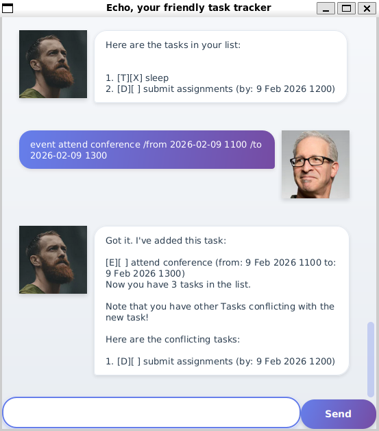

# Echo User Guide



Echo is a task management chatbot that helps you keep track of your todos, deadlines, and events. Echo uses a simple command-line interface to manage your tasks efficiently.

---

## Adding tasks

### Adding a Todo Task: `todo`

Adds a simple task without any date or time.

**Format:** `todo DESCRIPTION`

**Example:** `todo read book`

**Expected output**
```
Got it. I've added this task:
  [T][ ] read book
Now you have 1 tasks in the list.
```

---

### Adding a Deadline Task: `deadline`

Adds a task that needs to be completed by a specific date and time.

**Format:** `deadline DESCRIPTION /by DATE TIME`

**Example:** `deadline submit report /by 2026-01-25 1800`

**Expected output**
```
Got it. I've added this task:
  [D][ ] submit report (by: Jan 25 2026, 6:00 PM)
Now you have 2 tasks in the list.
```

---

### Adding an Event Task: `event`

Adds a task that occurs during a specific time period.

**Format:** `event DESCRIPTION /from START_TIME /to END_TIME`

**Example:** `event project meeting /from 2026-01-25 1400 /to 2026-01-25 1600`

**Expected output:**
```
Got it. I've added this task:
  [E][ ] project meeting (from: Jan 25 2026, 2:00 PM to: Jan 25 2026, 4:00 PM)
Now you have 3 tasks in the list.
```

---

### Listing All Tasks: `list`

Displays all tasks in your task list.

**Format:** `list`

**Example:** `list`

**Expected output:**
```
Here are the tasks in your list:

1. [T][ ] read book
2. [D][ ] submit report (by: Jan 25 2026, 6:00 PM)
3. [E][ ] project meeting (from: Jan 25 2026, 2:00 PM to: Jan 25 2026, 4:00 PM)
```

---

### Marking a Task as Done: `mark`

Marks a specific task as completed.

**Format:** `mark TASK_NUMBER`

**Example:** `mark 1`

**Expected output:**
```
Nice! I've marked this task as done:

[T][X] read book
```

---

### Unmarking a Task: `unmark`

Marks a specific task as not completed.

**Format:** `unmark TASK_NUMBER`

**Example:** `unmark 1`

**Expected output:**
```
OK, I've marked this task as not done yet:

[T][ ] read book
```

---

### Deleting a Task: `delete`

Removes a task from your task list.

**Format:** `delete TASK_NUMBER`

**Example:** `delete 2`

**Expected output:**
```
Noted. I've removed this task:
  [D][ ] submit report (by: Jan 25 2026, 6:00 PM)
Now you have 2 tasks in the list.
```

---

### Finding Tasks: `find`

Searches for tasks containing a specific keyword.

**Format:** `find KEYWORD`

**Example:** `find meeting`

**Expected output:**
```
Here are the matching tasks in your list:

1. [E][ ] project meeting (from: Jan 25 2026, 2:00 PM to: Jan 25 2026, 4:00 PM)
```

---

### Exiting the Program: `bye`

Exits the Echo application.

**Format:** `bye`

**Example:** `bye`

**Expected output:**
```
Bye. Hope to see you again soon!
```

---

## Command Summary

| Command | Format | Example |
|---------|--------|---------|
| **Todo** | `todo DESCRIPTION` | `todo read book` |
| **Deadline** | `deadline DESCRIPTION /by DATE TIME` | `deadline submit report /by 2026-01-25 1800` |
| **Event** | `event DESCRIPTION /from START /to END` | `event meeting /from 2pm /to 4pm` |
| **List** | `list` | `list` |
| **Mark** | `mark TASK_NUMBER` | `mark 1` |
| **Unmark** | `unmark TASK_NUMBER` | `unmark 1` |
| **Delete** | `delete TASK_NUMBER` | `delete 2` |
| **Find** | `find KEYWORD` | `find book` |
| **Exit** | `bye` | `bye` |

## Additional Features

### Automatic Conflict Detection

Echo automatically detects when you add a deadline or event that conflicts with existing tasks and warns you about potential scheduling conflicts. The task will still be added to your list, but you'll receive a warning message.

#### How Conflict Detection Works:

**Deadline Conflicts:**
- Two deadlines conflict if they are due at the exact same date and time
- A deadline conflicts with an event if the deadline time falls within the event's time period (excluding start and end times)

**Event Conflicts:**
- Two events conflict if their time periods overlap
- An event conflicts with a deadline if the deadline time falls within the event's time period

#### Example 1: Conflicting Deadlines

Suppose you have an existing deadline:
```
[D][ ] submit report (by: Jan 25 2026, 6:00 PM)
```

When you add another deadline with the same due date and time:

**Command:** `deadline complete assignment /by 2026-01-25 1800`

**Expected output:**
```
Got it. I've added this task:
  [D][ ] complete assignment (by: Jan 25 2026, 6:00 PM)
Now you have 2 tasks in the list.

Note that you have other Tasks conflicting with the new task!

Here are the conflicting tasks:
1. [D][ ] submit report (by: Jan 25 2026, 6:00 PM)
```

#### Example 2: Conflicting Events

Suppose you have an existing event:
```
[E][ ] project meeting (from: Jan 25 2026, 2:00 PM to: Jan 25 2026, 4:00 PM)
```

When you add an overlapping event:

**Command:** `event team discussion /from 2026-01-25 1500 /to 2026-01-25 1700`

**Expected output:**
```
Got it. I've added this task:
  [E][ ] team discussion (from: Jan 25 2026, 3:00 PM to: Jan 25 2026, 5:00 PM)
Now you have 2 tasks in the list.

Note that you have other Tasks conflicting with the new task!

Here are the conflicting tasks:
1. [E][ ] project meeting (from: Jan 25 2026, 2:00 PM to: Jan 25 2026, 4:00 PM)
```

#### Example 3: Deadline Conflicting with Event

Suppose you have an existing event:
```
[E][ ] conference (from: Jan 26 2026, 9:00 AM to: Jan 26 2026, 5:00 PM)
```

When you add a deadline that falls during the event:

**Command:** `deadline submit proposal /by 2026-01-26 1200`

**Expected output:**
```
Got it. I've added this task:
  [D][ ] submit proposal (by: Jan 26 2026, 12:00 PM)
Now you have 2 tasks in the list.

Note that you have other Tasks conflicting with the new task!

Here are the conflicting tasks:
1. [E][ ] conference (from: Jan 26 2026, 9:00 AM to: Jan 26 2026, 5:00 PM)
```

**Note:** Todos do not participate in conflict detection since they don't have specific dates or times.

---

## Notes

- Task numbers start from 1.
- Date format for deadlines and events should follow: `YYYY-MM-DD HHMM` (e.g., `2026-01-25 1800` for 6:00 PM on January 25, 2026).
- All commands are case-insensitive.
- Your tasks are automatically saved to `./data/echo.txt` after each operation.
- If the data file is corrupted or cannot be read, Echo will start with an empty task list.
